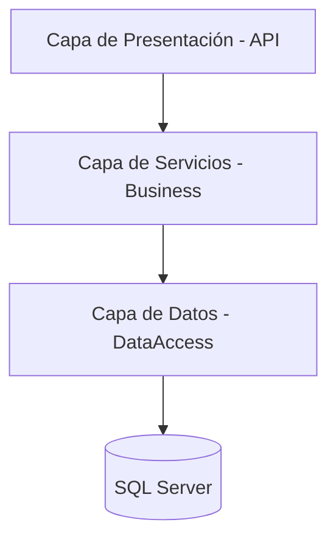

# 🚀 API Juju System - Gestión de Publicaciones

## 📝 Descripción del Proyecto
Sistema especializado en la orquestación de contenidos y gestión de clientes, desarrollado sobre **.NET Core 2.1**.  

La solución destaca por su motor de procesamiento por lotes (**Bulk Process**) con capacidad de filtrado inteligente y validaciones de integridad de datos en tiempo real.

---

## 🏛️ Arquitectura de la Solución
El proyecto sigue un patrón de **Arquitectura Limpia (Clean Architecture)** simplificada, optimizada para la escalabilidad y mantenibilidad.

### 📊 Diagrama de Capas


---

## 🔍 Desglose de Componentes

### 🧩 Presentación (REST API)
Controladores desacoplados que gestionan el ruteo y las respuestas HTTP estandarizadas.

### ⚙️ Capa de Servicios (Business Logic)
Orquestadores de procesos que aplican reglas de negocio complejas:
- Mapeo manual
- Truncado de texto
- Lógica de categorización

### 🗄️ Capa de Datos (Persistence)
Implementación de **Repository Pattern** sobre **Entity Framework Core** para abstracción total de la base de datos.

---

## ⚙️ Principios SOLID Aplicados

- **S - Single Responsibility:**  
  Cada capa tiene una única responsabilidad.

- **O - Open/Closed:**  
  Uso de `BaseRepository<TEntity>` para extender funcionalidades sin modificar la base.

- **L - Liskov Substitution:**  
  Repositorios específicos funcionan como sus interfaces base sin afectar comportamiento.

- **I - Interface Segregation:**  
  Interfaces específicas como `ICustomerService`, `IPostService`.

- **D - Dependency Inversion:**  
  Dependencia de abstracciones (interfaces), facilitando pruebas unitarias.

---

## 🛠️ Stack Tecnológico

- **Runtime:** .NET Core 2.1  
- **ORM:** Entity Framework Core + SQL Server  
- **Logging:** ILogger  
- **Documentación:** Swagger UI (OpenAPI)

---

## 🗄️ Modelo de Datos (ERD)

- **Customer:**  
  Almacena información del cliente.  
  ✔ Validación de unicidad del nombre.

- **Post:**  
  Publicaciones asociadas.  
  ✔ Validación de tipos (Farándula, Política, Fútbol)  
  ✔ Truncado automático de texto

---

## 📂 Estructura del Repositorio

```plaintext
📦 JujuApi
 ┣ 📂 API (Controladores y Configuración)
 ┣ 📂 Business (Servicios, DTOs y Reglas de Negocio)
 ┃ ┣ 📂 Common (Constants, Helpers, Interfaces)
 ┃ ┗ 📂 Services (Implementaciones)
 ┗ 📂 DataAccess (Contexto, Entidades y Repositorios)
```

---

## 📋 Endpoints Principales

### 👥 Customers
- `GET /api/customer` → Listado paginado  
- `POST /api/customer` → Creación con validación de nombre  

### 📝 Posts
- `POST /api/post/bulk` →  
  Motor de carga masiva con filtrado de clientes inexistentes y tipos no válidos  

- `DELETE /api/post/{id}` →  
  Eliminación física verificada  

---

## 🛡️ Manejo de Resultados

Todas las respuestas utilizan el envoltorio `ResponseApi<T>` para estandarizar la comunicación:

```json
{
  "succeeded": true,
  "message": "Proceso finalizado. Insertados: 10. Omitidos: 2.",
  "data": true
}
```

---

## 📌 Notas Finales

Este proyecto está diseñado para ser:
- Escalable 📈  
- Mantenible 🔧  
- Fácil de testear 🧪  

Siguiendo buenas prácticas de desarrollo en .NET.