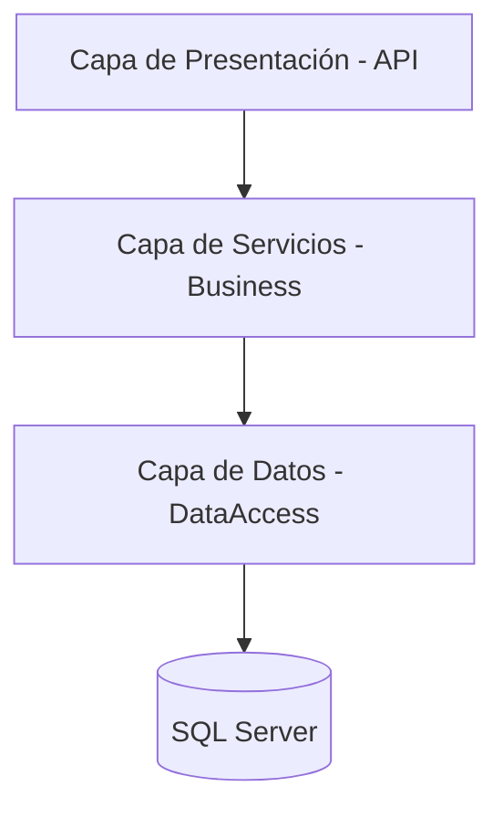
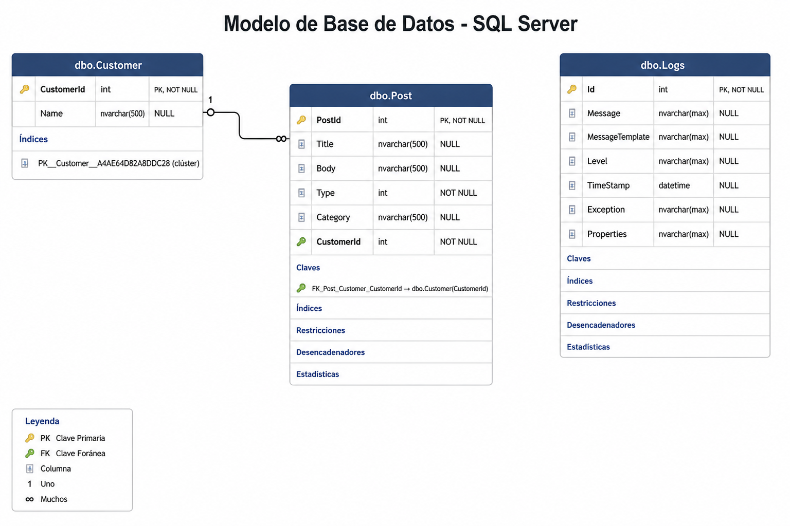

# 🚀 API Juju System - Gestión de Publicaciones

## 📝 Descripción del Proyecto
Sistema especializado en la orquestación de contenidos y gestión de clientes, desarrollado sobre **.NET Core 2.1**.  

La solución destaca por su motor de procesamiento por lotes (**Bulk Process**) con capacidad de filtrado inteligente y validaciones de integridad de datos en tiempo real.

---

## 🏛️ Arquitectura de la Solución
El proyecto sigue un patrón de **Arquitectura Limpia (Clean Architecture)** simplificada, optimizada para la escalabilidad y mantenibilidad.

### 📊 Diagrama de Capas


---

## 💎 Patrones de Diseño Implementados

El sistema garantiza la escalabilidad y el desacoplamiento mediante la aplicación de patrones probados en la industria:

1. **Repository Pattern**
   * **Implementación:** Se utiliza una clase `BaseRepository<TEntity>` que centraliza las operaciones de acceso a datos.
   * **Beneficio:** Abstrae la lógica de persistencia, permitiendo que los servicios operen sin conocer los detalles de Entity Framework Core.

2. **Unit of Work (Implícito)**
   * **Implementación:** Se gestiona a través del `DbContext` de EF Core.
   * **Beneficio:** Asegura la atomicidad de las operaciones. Por ejemplo, en el proceso de **Bulk Insert**, los cambios solo se confirman tras validar todo el lote mediante `SaveChangesAsync`.

3. **Operation Result Pattern**
   * **Implementación:** Uso de la clase genérica `ResponseApi<T>` para todas las respuestas de los controladores.
   * **Beneficio:** Estandariza la comunicación con el cliente, proporcionando metadatos sobre el éxito de la operación y mensajes de error claros provenientes de `AppMessages`.

4. **DTO (Data Transfer Objects) y Separación de Responsabilidades**
   * **Implementación:** Uso de objetos específicos para la entrada de datos en comandos `POST` y la salida en consultas `GET`.
   * **Beneficio:** Evita la exposición directa de las entidades de la base de datos, mejorando la seguridad y permitiendo transformar datos (como el truncado de strings) antes de ser devueltos.
---

## 🗄️ Modelo de Base de Datos (SQL Server)



---

## 🔍 Desglose de Componentes

### 🧩 Presentación (REST API)
Controladores desacoplados que gestionan el ruteo y las respuestas HTTP estandarizadas.

### ⚙️ Capa de Servicios (Business Logic)
Orquestadores de procesos que aplican reglas de negocio complejas:
- Mapeo manual
- Truncado de texto
- Lógica de categorización

### 🗄️ Capa de Datos (Persistence)
Implementación de **Repository Pattern** sobre **Entity Framework Core** para abstracción total de la base de datos.

---

## ⚙️ Principios SOLID Aplicados

- **S - Single Responsibility:**  
  Cada capa tiene una única responsabilidad.

- **O - Open/Closed:**  
  Uso de `BaseRepository<TEntity>` para extender funcionalidades sin modificar la base.

- **L - Liskov Substitution:**  
  Repositorios específicos funcionan como sus interfaces base sin afectar comportamiento.

- **I - Interface Segregation:**  
  Interfaces específicas como `ICustomerService`, `IPostService`.

- **D - Dependency Inversion:**  
  Dependencia de abstracciones (interfaces), facilitando pruebas unitarias.

---

## 🛠️ Stack Tecnológico

- **Runtime:** .NET Core 2.1  
- **ORM:** Entity Framework Core + SQL Server  
- **Logging:** ILogger  
- **Documentación:** Swagger UI (OpenAPI)

---

## 🗄️ Modelo de Datos (ERD)

- **Customer:**  
  Almacena información del cliente.  
  ✔ Validación de unicidad del nombre.

- **Post:**  
  Publicaciones asociadas.  
  ✔ Validación de tipos (Farándula, Política, Fútbol)  
  ✔ Truncado automático de texto

---

## 📂 Estructura del Repositorio

```plaintext
📦 JujuApi (ProjectAPI)
 ┣ 📂 API
 ┃ ┗ 📂 Controllers (Controladores de la API)
 ┣ 📂 Business
 ┃ ┣ 📂 Common (Constantes, Helpers, Interfaces)
 ┃ ┣ 📂 Dtos (Modelos de entrada/salida)
 ┃ ┣ 📂 Services (Lógica de negocio e implementaciones)
 ┃ ┗ 📂 Validators (Reglas de validación con FluentValidation)
 ┣ 📂 DataAccess
 ┃ ┣ 📂 Context (Configuración de Entity Framework)
 ┃ ┣ 📂 Data (Entidades de base de datos)
 ┃ ┗ 📂 Repositories (Acceso a datos)
 ┃ ┗ 📂 Interfaces (Interfaces repositorio)
 ┗ 📂 Tests
   ┣ 📂 Api.Tests
   ┃ ┗ 📂 ControllerTests (Pruebas unitarias para controladores)
   ┗ 📂 Business.Tests
     ┗ 📂 ServiceTests (Pruebas unitarias para servicios de negocio)
```

---

## 📋 Endpoints Principales

### 👥 Customers
- `GET /api/customer` → Listado paginado  
- `POST /api/customer` → Creación con validación de nombre  

### 📝 Posts
- `POST /api/post/bulk` →  
  Motor de carga masiva con filtrado de clientes inexistentes y tipos no válidos  

- `DELETE /api/post/{id}` →  
  Eliminación física verificada  

---

## 🛡️ Manejo de Resultados

Todas las respuestas utilizan el envoltorio `ResponseApi<T>` para estandarizar la comunicación:

```json
{
  "succeeded": true,
  "message": "Proceso finalizado. Insertados: 10. Omitidos: 2.",
  "data": true
}
```

---

## 📌 Notas Finales

Este proyecto está diseñado para ser:
- Escalable 📈  
- Mantenible 🔧  
- Fácil de testear 🧪  

Siguiendo buenas prácticas de desarrollo en .NET.