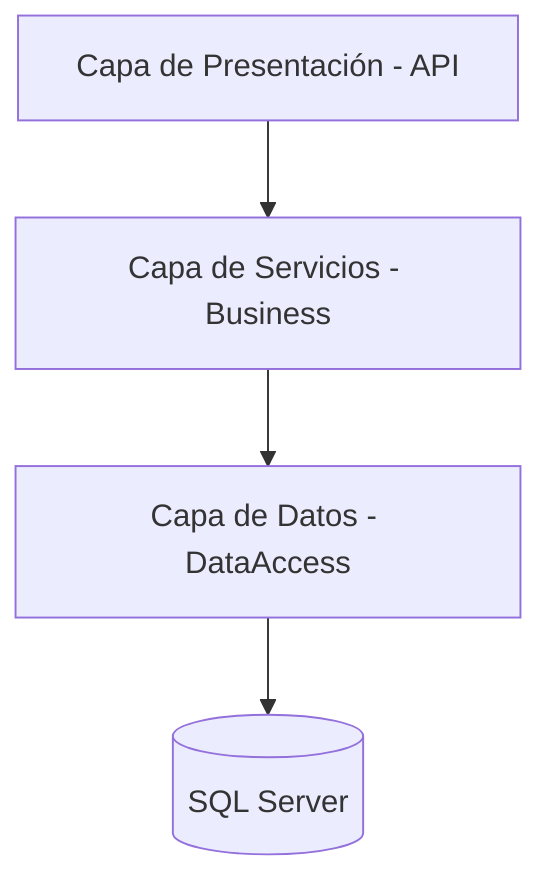

# 🚀 API Juju System - Gestión de Publicaciones

## 📝 Descripción del Proyecto
Sistema especializado en la orquestación de contenidos y gestión de clientes, desarrollado sobre **.NET Core 2.1**.  

La solución destaca por su motor de procesamiento por lotes (**Bulk Process**) con capacidad de filtrado inteligente y validaciones de integridad de datos en tiempo real.

---

## 🏛️ Arquitectura de la Solución
El proyecto sigue un patrón de **Arquitectura Limpia (Clean Architecture)** simplificada, optimizada para la escalabilidad y mantenibilidad.

### 📊 Diagrama de Capas


---

## 💎 Patrones de Diseño Implementados

El sistema garantiza la escalabilidad y el desacoplamiento mediante la aplicación de patrones probados en la industria:

1. **Repository Pattern**
   * **Implementación:** Se utiliza una clase `BaseRepository<TEntity>` que centraliza las operaciones de acceso a datos.
   * **Beneficio:** Abstrae la lógica de persistencia, permitiendo que los servicios operen sin conocer los detalles de Entity Framework Core.

2. **Unit of Work (Implícito)**
   * **Implementación:** Se gestiona a través del `DbContext` de EF Core.
   * **Beneficio:** Asegura la atomicidad de las operaciones. Por ejemplo, en el proceso de **Bulk Insert**, los cambios solo se confirman tras validar todo el lote mediante `SaveChangesAsync`.

3. **Operation Result Pattern**
   * **Implementación:** Uso de la clase genérica `ResponseApi<T>` para todas las respuestas de los controladores.
   * **Beneficio:** Estandariza la comunicación con el cliente, proporcionando metadatos sobre el éxito de la operación y mensajes de error claros provenientes de `AppMessages`.

4. **DTO (Data Transfer Objects) y Separación de Responsabilidades**
   * **Implementación:** Uso de objetos específicos para la entrada de datos en comandos `POST` y la salida en consultas `GET`.
   * **Beneficio:** Evita la exposición directa de las entidades de la base de datos, mejorando la seguridad y permitiendo transformar datos (como el truncado de strings) antes de ser devueltos.
---

## 🗄️ Modelo de Base de Datos (SQL Server)


---

## 🔍 Desglose de Componentes

### 🧩 Presentación (REST API)
Controladores desacoplados que gestionan el ruteo y las respuestas HTTP estandarizadas.

### ⚙️ Capa de Servicios (Business Logic)
Orquestadores de procesos que aplican reglas de negocio complejas:
- Mapeo manual
- Truncado de texto
- Lógica de categorización

### 🗄️ Capa de Datos (Persistence)
Implementación de **Repository Pattern** sobre **Entity Framework Core** para abstracción total de la base de datos.

---

## ⚙️ Principios SOLID Aplicados

- **S - Single Responsibility:**  
  Cada capa tiene una única responsabilidad.

- **O - Open/Closed:**  
  Uso de `BaseRepository<TEntity>` para extender funcionalidades sin modificar la base.

- **L - Liskov Substitution:**  
  Repositorios específicos funcionan como sus interfaces base sin afectar comportamiento.

- **I - Interface Segregation:**  
  Interfaces específicas como `ICustomerService`, `IPostService`.

- **D - Dependency Inversion:**  
  Dependencia de abstracciones (interfaces), facilitando pruebas unitarias.

---

## 🛠️ Stack Tecnológico

- **Runtime:** .NET Core 2.1  
- **ORM:** Entity Framework Core + SQL Server  
- **Logging:** ILogger  
- **Documentación:** Swagger UI (OpenAPI)

---

## 🗄️ Modelo de Datos (ERD)

- **Customer:**  
  Almacena información del cliente.  
  ✔ Validación de unicidad del nombre.

- **Post:**  
  Publicaciones asociadas.  
  ✔ Validación de tipos (Farándula, Política, Fútbol)  
  ✔ Truncado automático de texto

---
## ✅ Requerimientos de la Prueba

Se implementaron las siguientes soluciones solicitadas:

1. ✔ Corrección del endpoint de actualización de Customer  
2. ✔ Validación de nombre único en creación de Customer  
3. ✔ Validaciones de negocio en creación de Post:
   - Validación de existencia del Customer  
   - Truncado de texto según reglas de negocio (longitud máxima + sufijo "...")  
   - Asignación automática de Category según Type  
4. ✔ Eliminación en cascada de Post al eliminar Customer  
5. ✔ Implementación de API de carga masiva (Bulk Post)  
6. ✔ Mejora general del código aplicando buenas prácticas (Clean Architecture, SOLID)

---

## 🚀 Mejoras Adicionales Implementadas

- ✔ Endpoint para obtener Customer por ID  
- ✔ Endpoint para actualizar Customer  
- ✔ Endpoint para eliminar Customer  
- ✔ Endpoint para listar Posts paginados  
- ✔ Endpoint para obtener Post por ID  
- ✔ Validaciones centralizadas en servicios  
- ✔ Manejo estandarizado de respuestas (`ResponseApi<T>`)  
- ✔ Implementación de paginación reutilizable  
- ✔ Optimización de base de datos mediante índice en columna `Name`

---

### ⚡ Optimización de Base de Datos

Se implementó un índice para mejorar el rendimiento en búsquedas por nombre de cliente:

```sql
CREATE INDEX IX_Customer_Name 
ON [JujuTest].[dbo].[Customer](Name);
```

---

## 📂 Estructura del Repositorio

```plaintext
📦 JujuApi (ProjectAPI)
 ┣ 📂 API
 ┃ ┗ 📂 Controllers (Controladores de la API)
 ┣ 📂 Business
 ┃ ┣ 📂 Common (Constantes, Helpers, Interfaces)
 ┃ ┣ 📂 Dtos (Modelos de entrada/salida)
 ┃ ┣ 📂 Services (Lógica de negocio e implementaciones)
 ┃ ┗ 📂 Validators (Reglas de validación con FluentValidation)
 ┣ 📂 DataAccess
 ┃ ┣ 📂 Context (Configuración de Entity Framework)
 ┃ ┣ 📂 Data (Entidades de base de datos)
 ┃ ┣ 📂 Repositories (Acceso a datos)
 ┃ ┗ 📂 Interfaces (Interfaces repositorio)
 ┗ 📂 Tests
   ┣ 📂 Api.Tests
   ┃ ┗ 📂 ControllerTests (Pruebas unitarias para controladores)
   ┗ 📂 Business.Tests
     ┗ 📂 ServiceTests (Pruebas unitarias para servicios de negocio)
```
---
## 📋 Endpoints Principales

### 👥 Customers

- `GET /api/customer`  
  → Listado paginado de clientes  

- `GET /api/customer/{id}`  
  → Obtener cliente por ID  

- `POST /api/customer`  
  → Creación de cliente con validaciones de negocio  

- `PUT /api/customer/{id}`  
  → Actualización de cliente existente  

- `DELETE /api/customer/{id}`  
  → Eliminación de cliente y sus dependencias  

---

### 📝 Posts

- `GET /api/post`  
  → Listado paginado de publicaciones  

- `GET /api/post/{id}`  
  → Obtener publicación por ID  

- `POST /api/post`  
  → Creación de publicación con reglas de negocio (truncado y categorización)  

- `POST /api/post/bulk`  
  → Carga masiva de publicaciones  
  ✔ Filtra clientes inexistentes  
  ✔ Valida tipos no permitidos  
  ✔ Aplica reglas automáticamente  

- `DELETE /api/post/{id}`  
  → Eliminación de publicación  

---

## 🛡️ Manejo de Resultados

Todas las respuestas utilizan el envoltorio `ResponseApi<T>` para estandarizar la comunicación:

```json
{
  "succeeded": true,
  "message": "Proceso finalizado. Insertados: 10. Omitidos: 2.",
  "data": true
}
```

---

## ⚙️ Ejecución del Proyecto

1. Restaurar la base de datos:
   - Usar archivo `.bak` o script `.sql`

2. Configurar la cadena de conexión en:
   - `appsettings.json`

3. Ejecutar el proyecto:

```bash
dotnet run
```

4. Acceder a Swagger:
```
https://localhost:{port}/swagger
```
---

## 📌 Notas Finales

Este proyecto está diseñado para ser:
- Escalable 📈  
- Mantenible 🔧  
- Fácil de testear 🧪  

Siguiendo buenas prácticas de desarrollo en .NET.

---
